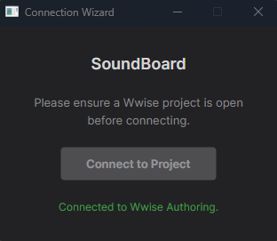
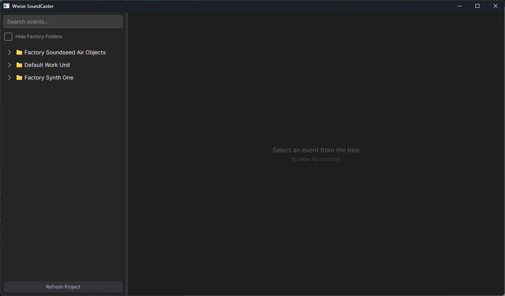
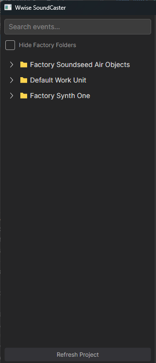
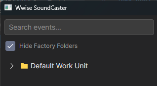
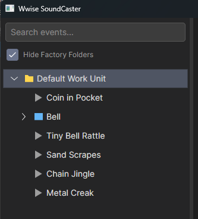
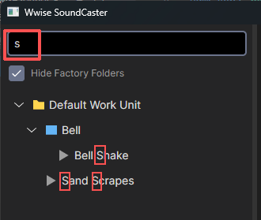
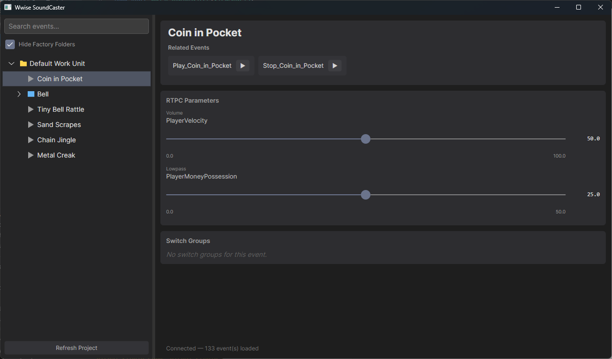
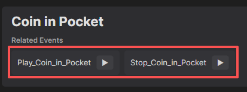
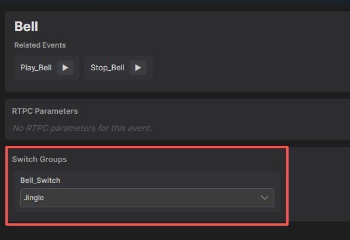
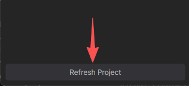

# SoundBoard

- [SoundBoard](#soundboard)
  - [简体中文](#简体中文)
    - [概述](#概述)
    - [功能与使用](#功能与使用)
      - [连接至Wwise项目](#连接至wwise项目)
      - [主窗口](#主窗口)
        - [事件列表](#事件列表)
        - [物体详情](#物体详情)
      - [重加载项目](#重加载项目)
    - [总结](#总结)
  - [ENGLISH](#english)
    - [Overview](#overview)
    - [Features and Usage](#features-and-usage)
      - [Connecting to a Wwise Project](#connecting-to-a-wwise-project)
      - [Main Window](#main-window)
        - [Event List](#event-list)
        - [Object Details](#object-details)
      - [Reload Project](#reload-project)
    - [Summary](#summary)

## 简体中文

### 概述

SoundBoard 是一个基于Wwise Authoring API的声音管理工具。

设计师们现在可以通过该工具直接接入Wwise的声音事件，摆脱了Unity引擎的依赖。

项目提供了简单清晰的UI界面，展示了与声音事件绑定的各种参数，设计师们可以直接在界面上调整这些参数，并实时预览声音效果。

  

### 功能与使用

#### 连接至Wwise项目

当项目打开时，SoundBoard会弹出`Connection Wizard`窗口，提示用户点按按钮连接到Wwise项目。

 

> 注意： Wwise项目必须处于打开状态，且Wwise Authoring API必须已在项目设置中启用。

点击按钮后，SoundBoard会尝试连接到Wwise项目，并在成功连接后短暂提示连接成功。

连接成功后，SoundBoard会自动加载主窗口，并显示Wwise项目中所有的声音事件。

   

#### 主窗口
主窗口展示了Wwise项目中所有的声音事件，设计师们可以在这里浏览和选择不同的声音事件。

 

##### 事件列表

左侧的列表展示了Wwise项目中的所有声音物体，设计师们可以通过点击事件来查看详细信息。

 

> 在Wwise 2025中，Wwise项目包含了Factory的默认声音物体。为了简化工作流程，SoundBoard提供了`过滤功能`，设计师们可以选择是否显示这些默认声音物体。
>
> 

 

用户可以点按物体名称左侧的箭头来展开该物体或文件夹内的子物体。

 

`黄色文件夹图标`表示该物体是一个文件夹，点击后可以展开或收起其中的子物体。

`蓝色方块图标`表示该物体是一个`Switch Container`，点击后可以展开或收起该容器内的子物体。右侧将显示该`Switch Container`的详细信息。

`灰色三角图标`表示该物体是一个普通的声音物体，点击后会在右侧显示该物体的详细信息。

 

SoundBoard提供了项目内搜索功能，设计师们可以通过输入关键词来快速找到特定的声音事件。特别的，搜索结果`不会`包含已被隐藏的物体。

  

##### 物体详情
在左侧列表点按选择后，右侧会显示该物体的详细信息，包括`物体名称`、Wwise中添加的`备注`，已创建的`事件`，`RTPC`，和`Switch Group`。

 

1. **事件**

如果一个物体绑定了`事件`，设计师可以直接点按`事件`按钮来向Wwise广播该事件。

> 该操作等同于在游戏引擎中使用`AkSoundEngine.PostEvent`函数来广播事件。

在该示例中，用户可以点击`Play_Coin_in_Pocket`事件来播放声音，或者点击`Stop_Coin_in_Pocket`事件来停止声音。

> 事件名称是自动从Wwise项目中获取的。用户看到的命名与Wwise项目中的命名**完全一致**。

 

2. **RTPC**

如果一个物体绑定了`RTPC`，设计师可以通过调整`RTPC`的滑动条来实时改变声音参数。

> 该操作等同于在游戏引擎中使用`AkSoundEngine.SetRTPCValue`函数来设置RTPC值。

SoundBoard会自动获取并设置`RTPC`的最大、最小值。默认值被设定为 **$min + \frac{max - min}{2}$**。

设计师可以拖动滑块，或双击右侧的显示标签来输入一个具体的数值。

 

3. **Switch Group**

如果一个物体绑定了`Switch Group`（即`Switch Container`），设计师可以通过切换`Switch Group`的选项来改变声音的状态。

> 该操作等同于在游戏引擎中使用`AkSoundEngine.SetSwitch`函数来设置Switch状态。

SoundBoard会自动获取`Switch Group`的所有选项，并在界面上以下拉选项的形式展现。设计师们可以直接点击选项来切换状态。

  

#### 重加载项目

如果设计师们在使用SoundBoard的过程中对Wwise项目进行了**修改**（例如添加了新的事件、RTPC或Switch Group），可以通过点击主窗口左侧列表最下方的`Refresh Project`按钮来重新加载项目。

   

### 总结

SoundBoard为设计师们提供了一个便捷的工具，使他们能够直接在界面上了解Wwise项目中的声音事件参数，并**实时预览效果**。通过连接到Wwise项目，设计师们可以轻松浏览和预览**声音事件**，调整**RTPC值**，以及切换**Switch Group状态**，提升了工作效率和创作体验。

    

## ENGLISH

### Overview

SoundBoard is a sound management tool based on the Wwise Authoring API.

Designers can now directly access Wwise sound events through this tool, eliminating the dependency on the Unity engine.

The project provides a simple and clear UI, displaying various parameters bound to sound events, allowing designers to adjust these parameters directly in the interface and preview the sound effects in real time.

  

### Features and Usage

#### Connecting to a Wwise Project

When the project is opened, SoundBoard will pop up the `Connection Wizard` window, prompting the user to click the button to connect to the Wwise project.

 

> Note: The Wwise project must be open, and the Wwise Authoring API must be enabled in the project settings.

After clicking the button, SoundBoard will attempt to connect to the Wwise project and briefly display a success message upon successful connection.

After a successful connection, SoundBoard will automatically load the main window and display all the sound events in the Wwise project.

   

#### Main Window
The main window displays all the sound events in the Wwise project, allowing designers to browse and select different sound events.

 

##### Event List

The list on the left displays all the sound objects in the Wwise project, and designers can click on an event to view its details.

 

> In Wwise 2025, Wwise projects include default sound objects from the Factory. To streamline the workflow, SoundBoard provides a `filtering feature` that allows designers to choose whether to display these default sound objects.
>
> 

 

Users can click the arrow to the left of an object's name to expand the object or the child objects within a folder.

 

`Yellow folder icon` indicates that the object is a folder, which can be expanded or collapsed to show or hide its child objects.

`Blue square icon` indicates that the object is a `Switch Container`, which can be expanded or collapsed to show or hide its child objects. The details of the `Switch Container` will be displayed on the right side.

`Gray triangle icon` indicates that the object is a regular sound object, and clicking on it will display its details on the right side.

 

SoundBoard provides an in-project search feature, allowing designers to quickly find specific sound events by entering keywords. Notably, the search results `will not` include hidden objects.

  

##### Object Details
After selecting an object from the list on the left, the details of the object will be displayed on the right side, including the `object name`, `notes` added in Wwise, created `events`, `RTPCs`, and `Switch Groups`.

 

1. **Events**

If an object is bound to `events`, designers can directly click the `event` buttons to broadcast the events to Wwise.

> This operation is equivalent to using the `AkSoundEngine.PostEvent` function in the game engine.

In this example, users can click the `Play_Coin_in_Pocket` event to play the sound or click the `Stop_Coin_in_Pocket` event to stop the sound.

> The event names are automatically retrieved from the Wwise project. The names users see are **exactly the same** as those in the Wwise project.

 

2. **RTPC**

If an object is bound to `RTPC`, designers can adjust the `RTPC` slider to change the sound parameters in real time.

> This operation is equivalent to using the `AkSoundEngine.SetRTPCValue` function in the game engine.

SoundBoard will automatically retrieve and set the maximum and minimum values for the `RTPC`. The default value is set to **$min + \frac{max - min}{2}$**.

Designers can drag the slider or double-click the display label on the right to enter a specific value.

 

3. **Switch Group**

If an object is bound to `Switch Group` (i.e., `Switch Container`), designers can change the sound state by switching the options of the `Switch Group`.

> This operation is equivalent to using the `AkSoundEngine.SetSwitch` function in the game engine.

SoundBoard will automatically retrieve all options of the `Switch Group` and display them as a dropdown menu in the interface. Designers can directly click the options to switch states.

  

#### Reload Project

If designers make **modifications** to the Wwise project while using SoundBoard (e.g., adding new events, RTPCs, or Switch Groups), they can click the `Refresh Project` button at the bottom of the list on the left side of the main window to reload the project.

   

### Summary

SoundBoard provides designers with a convenient tool to directly understand the sound event parameters in the Wwise project and **preview the effects in real time**. By connecting to the Wwise project, designers can easily browse and preview **sound events**, adjust **RTPC values**, and switch **Switch Group states**, improving work efficiency and creative experience.

    

由李江浩编写
Created by Jianghao Li

   
***Credits***
The project icon comes from [pngtree]("https://pngtree.com/freepng/sound-icon_3581551.html")

Wwise and Wwise Authoring API are products of Audiokinetic Inc. SoundBoard is an independent project developed by Jianghao Li and is not affiliated with Audiokinetic Inc. in any way.